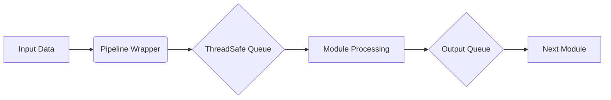

<div align="center">
  <a href="https://robotics.sydney.edu.au/our-research/robotic-perception/">
    
  </a>

  # DynoSAM: Dynamic Object Smoothing and Mapping

  **A Stereo/RGB-D Visual Odometry pipeline for Dynamic SLAM.**

  DynoSAM estimates camera poses, object motions/poses, as well as static background and temporal dynamic object maps. It provides **full-batch**, **sliding-window**, and **incremental** optimization procedures and is fully integrated with **ROS2**.

  [](https://docs.ros.org/en/kilted/index.html)
  [](./LICENSE)
  [](https://arxiv.org/pdf/2501.11893)

</div>

<br />

<div align="center">
  
   <p style="font-style: italic; color: gray;"> DynoSAM running Parallel-Hybrid formulation in incremental optimisation mode on a indoor sequence recorded with an Intel RealSense. Playback is 2x speed.</p>
</div>

<div align="center">
  
  <p style="font-style: italic; color: gray;"> Example output running on the Oxford Multimotion Dataset (OMD, 'Swinging 4 Unconstrained'). This visualisation was generated using playback after full-batch optimisation.</p>
</div>

## 📚 Publications
The offical code used for our paper:
- [Jesse Morris](https://jessemorris.github.io/), Yiduo Wang, Mikolaj Kliniewski, Viorela Ila, [*DynoSAM: Open-Source Smoothing and Mapping Framework for Dynamic SLAM*](https://arxiv.org/pdf/2501.11893).  Accepted Transactions on Robotics (T-RO) Visual SLAM Special Issue (2025).

#### ** Update November 2025 **
Our work has been accepted to IEEE Transactions on Robotics (T-RO)


#### ** Update September 2025 **
This code now also contains the code for our new work
- J.Morris, Y. Wang, V. Ila. [*Online Dynamic SLAM with Incremental Smoothing and Mapping*](https://www.arxiv.org/abs/2509.08197), Arxiv. Submitted RA-L (2025)


We kindly ask to cite our papers if you find these works useful:


```bibtex

@misc{morris2025dynosam,
  author={Morris, Jesse and Wang, Yiduo and Kliniewski, Mikolaj and Ila, Viorela},
  journal={IEEE Transactions on Robotics},
  title={DynoSAM: Open-Source Smoothing and Mapping Framework for Dynamic SLAM},
  year={2025},
  doi={10.1109/TRO.2025.3641813}
}

@article{morris2025online,
  title={Online Dynamic SLAM with Incremental Smoothing and Mapping},
  author={Morris, Jesse and Wang, Yiduo and Ila, Viorela},
  journal={arXiv preprint arXiv:2509.08197},
  year={2025}
}
```

### Related Publications

DynoSAM was build as a culmination of several works:

- J. Morris, Y. Wang, V. Ila.  [**The Importance of Coordinate Frames in Dynamic SLAM**](https://acfr-rpg.github.io/dynamic_slam_coordinates/). IEEE Intl. Conf. on Robotics and Automation (ICRA), 2024
- J. Zhang, M. Henein, R. Mahony, V. Ila [**VDO-SLAM:  A Visual Dynamic Object-aware SLAM System**](https://arxiv.org/abs/2005.11052), ArXiv
- M. Henein, J. Zhang, R. Mahony, V. Ila. [**Dynamic SLAM: The Need for Speed**](https://ieeexplore.ieee.org/abstract/document/9196895).2020 IEEE International Conference on Robotics and Automation (ICRA). IEEE, 2020.

## 📖 Overview

### Key Features (Nov 2025 Update)
* 🚀 **CUDA Integration:** Front-end acceleration.
* 🧠 **TensorRT:** Integrated object detection and tracking.
* ⚡ **Sparse Tracking:** Options to move away from dense optical flow.
* 📦 **Modular:** System broken into packages for faster compile times.
* 🐳 **Docker:** Updated image with new dependencies.

## Documentation
We auto generate [Doxygen code docs](https://acfr-rpg.github.io/DynOSAM/doxygen/) for all classes in DynoSAM. The code docs are up-to-date with the _main_ branch.


# 1. ⚙️ Installation

We provide a detailed installation guide including dependencies and Docker support.
See detailed instructions here: [Insallation instructions](./docs/media/INSTALL.md)

## 1.1 Edge Device Support
We currently support building for AARM64 devices and DynoSAM has been tested on an NVIDIA ORIN NX. Docker file support and more details are provided in the install instructions.

> NOTE: DynoSAM does not currently run real-time on the ORIN NX (mostly bottlenecked by the object detection process). On a more powerful device better performance is expected.

Also see the [Docker REAMDE.md](./docker/README.md) and the [dynosam_nn README.md](./dynosam_nn//README.md) for more information on hardware and performance.

# 2. 🚀 Running DynoSAM

## 2.1 Paramters
DynoSAM is configured using a combination of **YAML files** (pipeline, frontend, datasets) and **GFLAGS** (overridable command-line parameters). ROS parameters are used only for input file paths.

All `.yaml` and `.flags` files must be placed in a single parameter folder which defines the `params_path`.
```
params/
  FrontendParams.yaml
  PipelineParams.yaml
  [DatasetParams.yaml]
  [CameraParams.yaml]
  *.flags
```
- YAML files are loaded using config_utilities.
- GFlags provide run-time reconfiguration (important for automated experiments).
- ROS parameters are used sparingly (mainly for file paths).


> NOTE: Note: Additional GFlags cannot be passed through ros2 launch.
To override GFlags pass them directly with ros2 run, or modify the flag files inside the params folder.

To print active parameters:
```
ros2 run dynosam_utils eval_launch.py --show_dyno_args=true
```
To see all gflag options run:
```
ros2 run dynosam_ros dynosam_node --help
```

## 2.2 Quick Start (Launch File)
Launch the full pipeline with ROS2:

```
ros2 launch dynosam_ros dyno_sam_launch.py \
    params_path:=<path-to-params-folder> \
    dataset_path:=<path-to-dataset> \
    v:=<verbosity> \
    --data_provider_type=<data_set_loader_type> \
    --output_path=</path/to/output/folder>
```

The launch file:
- Loads all `.flags` files in the parameter folder,
- Applies dataset provider selection via `--data_provider_type`,
- Logs outputs to `--output_path` (must exist beforehand).

## 2.3 Experiment & Evaluation Launcher

For fine‑grained control and automated experiments, use:

```
ros2 run dynosam_utils eval_launch.py \
    --dataset_path <path> \
    --params_path <absolute path> \
    --output_path <path> \
    --name <experiment name> \
    --run_pipeline \
    --run_analysis \
    <extra GFLAG cli arguments>
```

This script:
- Automates running the pipeline and evaluations,
- Forwards all extra CLI arguments to DynoSAM (allowing any GFLAG override),
- Creates result folders `output_path/name/` automatically.

Example:

```
ros2 run dynosam_utils eval_launch.py \
    --output_path=/tmp/results \
    --name=test \
    --run_pipeline \
    --data_provider_type=2
```

## 2.4 Programmatic Execution (Python)

All command‑line behaviour can be replicated in Python.
See: [run_experiments_tro.py](./dynosam_utils/src/run_experiments_tro.py) for examples.


# 3. 📂 Datasets

## 3.1 Pre-processing Image data
DynoSAM requires input image data in the form:
- RGB
- Depth/Stereo
- Dense Optical Flow
- Dense Semantic Instance mask

Each image is expected in the following form:
-  __rgb__ image is expected to be a valid 8bit image (1, 3 and 4 channel images are accepted).
-  __depth__ must be a _CV_64F_ image where the value of each pixel represents the _metric depth_.
-  __mask__ must be a CV_32SC1 where the static background is of value $0$ and all other objects are lablled with a tracking label $j$. $j$ is assumed to be globally consistent and is used to map the tracked object $j$ to the ground truth.
- __flow__ must be a CV_32FC2 representing a standard optical-flow image representation.

For dense optical flow (ie. pre Novemeber 2025) we use [RAFT](https://link.springer.com/chapter/10.1007/978-3-030-58536-5_24). Currently this pre-processing code is not available.

For instance segmentation we use [YOLOv8](https://docs.ultralytics.com/models/yolov8/) for both image pre-processing and online processing. Both Python and C++ (using TensorRT acceleration) models can be found in the [dynosam_nn](./dynosam_nn/) package. See the [REAMDE](./dynosam_nn/README.md) for more details.

- If `prefer_provided_optical_flow: true` (YAML), the pipeline expects a dense flow image. Otherwise, it falls back to sparse KLT.
- If `prefer_provided_object_detection: true` (YAML) , an instance mask must be provided. If false, masks are generated online via.


## 3.2 Running with pre-processed data

DynoSAM provides dataset loaders that parse pre-processed images (ie. depth, optical flow, masks), and ground truth into a unified format.

All official datasets are hosted at the [ACFR-RPG Datasets page](https://data.acfr.usyd.edu.au/rpg/).
To download a dataset, create a directory for the relevant dataset and, within the directory, run the command
```bash
wget -m -np -nH --cut-dirs=4 -R "index.html*" https://data.acfr.usyd.edu.au/rpg/dynosam/[Dataset]/[Subset]
```
For example, for the `kitti` dataset with subset `0004`, create and enter the directory `kitti-0004` download all files:
```
wget -m -np -nH --cut-dirs=4 -R "index.html*" https://data.acfr.usyd.edu.au/rpg/dynosam/kitti/0004
```

> NOTE: when developing using docker, download the sequences into the data folder mounted into the docker container so it may be accessed by the program.

The following datasets are officially supported:
| Dataset | Dataset ID | Notes |
|--------|--------------|-------|
| KITTI Tracking | 0 | Uses modified version with GT motion, flow, masks. |
| Virtual KITTI 2 | 1 | Raw dataset supported directly. |
| Cluster-SLAM (CARLA) | 2 | Raw dataset available; we recommend our processed version. |
| Oxford Multimotion (OMD) | 3 | Modified 2024 version available. |
| TartanAir Shibuya | 5 | Preprocessed version supported. |
| VIODE | 6 | IMU-enabled sequences supported. |

To run a specific dataset only two GFLAGS are required:
```
--dataset_path
--data_provider_type
```
where `--dataset_path` points to the location of the dataset and `--data_provider_type` should be set to Dataset ID.


> NOTE: when using ground truth for evaluation it is important to ensure that `prefer_provided_object_detection: false` so that the pre-processing object masks are used. This ensures that tracking label $j$ used within the pipeline aligns with the ground truth label.
## 3.3 Online Data
DynoSAM can also run from data provided by ROS.


To run with online data (e.g. from raw sensor data) set the ROS parameter:
```
online:=True
```

DynoSAM can run in two input modes which can be set using the ROS parameter `input_image_mode`:
- `ALL` (`input_image_mode=0`)
- `RGBD` (`input_image_mode=1`).

When in `ALL` mode, all image-preprocessing is done upstream and five inputs are required:
By default this node subscribes to five topics:
 - `dataprovider/image/camera_info` (sensor_msgs.msg.CameraInfo)
 - `dataprovider/image/rgb` (sensor_msgs.msg.Image)
 - `dataprovider/image/depth` (sensor_msgs.msg.Image)
 - `dataprovider/image/mask` (sensor_msgs.msg.Image)
 - `dataprovider/image/flow` (sensor_msgs.msg.Image)


In `RGBD` mode, only camera intrinsics, rgb and depth images are required and all other image processing (including object detection) is done as part of the pipeline.


### 3.2.1 Running using RBG-D camera

To run from data provided by an RGB-D camera use
```
PYTHON_VERSION=$(python3 -c "import sys; print(f'{sys.version_info.major}.{sys.version_info.minor}')")
cd /home/user/dev_ws && colcon build --cmake-args -DENABLE_DYNAMIC_SLAM_INTERFACES=ON
ros2 launch dynosam_ros dyno_sam_online_rgbd_launch.py
```
and remap the topics accordingly.


# 4. 🕹️ System Configuration

## 4.1 Backend Setup

Running Different Backends

DynoSAM supports multiple backend formulations. Set the `backend_updater_enum` flag to switch between them.

| Enum | Formulation | Paper | Description |
| :---: | :--- | :--- | :--- |
| **0** | `WCME` | TRO 2025 | World-Centric Motion Estimator |
| **1** | `WCPE` | TRO 2025 | World-Centric Pose Estimator |
| **2** | `HYBRID` | RA-L 2025 | Hybrid formulation |
| **3** | `PARALLEL_HYBRID` | RA-L 2025 | Parallel Hybrid (Recommended for speed) |

Many factor-graph related paramters exist in the `backend.flags` file.

## 4.2 Instance Segmentation
DynoSAM uses YOLOv8 for object detection. The model is integrated into the front-end and accelerated using CUDA and TensorRT.

To run the pipeline with online segmentation and object tracking set
```
prefer_provided_object_detection: true
```

See the [dynosam_nn README.md](./dynosam_nn//README.md) for more detail on the models used and how to export the weights.

> NOTE: the provided datasets contain pre-computed object masks with tracking labels $j$ that align with the ground truth. Use `prefer_provided_object_detection: false`.

## 4.3 IMU integration
We additionally support IMU integration using the `PreintegrationFactor` from GTSAM in the backend. However, this has only been tested on VIODE.

## 4.4 ROS Visualisation
All 3D visualisation in DynoSAM is done using RVIZ. Camera pose and point clouds are vizualised using standard ROS messages. Visualising the objects is more complex and we provide two different ways to do this which can be controlled at compile time using the cmake flag `-DENABLE_DYNAMIC_SLAM_INTERFACES=ON/OFF`

1. (`ON`, now default) Usage of the custom `dynamic_slam_interfaces::msg::ObjectOdometry` (in [dynamic_slam_interfaces](https://github.com/ACFR-RPG/dynamic_slam_interfaces)) to publish to current state of the each object per frame. Our custom RVIZ plugin [rviz_dynamic_slam_plugins](https://github.com/ACFR-RPG/rviz_dynamic_slam_plugins) can be used to visualize this message type. The object id, current pose, velocity, path etc... will be shown for each object. See this [README.md](./dynosam_ros/include/dynosam_ros/displays/dynamic_slam_displays/README.md) for more detail.
2. (`OFF`) Instead of using the custom messages, standard ROS visualisation messages are used instead to display the state of each object (object id, current pose...). This setup is therefore more complex, and results in many more advertised topics to achieve a similar (and less flexible) display than using the custom plugin/interface combination. As a result, this method of display is not preferred. See this [README.md](./dynosam_ros/include/dynosam_ros/displays/inbuilt_displays/README.md) for more detail.

> NOTE: the publishing of object states is meant primilarily for __visualisation__ purposes and not for recording data used for evaluation. This is done using csv files in a different submodule: see [Evaluation](#4-evaluation).

## 4.5 Tests
We use [gtest](https://github.com/google/googletest) for unit testing. This is installed automagically. When building with ROS, all tests will go into the install folder.


We provide a useful script to make running tests easier:
```
ros2 run dynosam_ros run_dynosam_gtest.py
```
Running unit tests for a specific package (ie. `dynosam` and `dynosam_ros`) can be specified using the `--package` argumement.

This script forwards all arguments to the test executable. This allows GFLAGS to be specified directly via the CLI.
```
run dynosam_ros run_dynosam_gtest.py --package=dynosam_ros --gtest_filter=TestConcepts*
```


# 5. 📊 Output & Metrics

The eval script should be used when generating results
```
ros2 run dynosam_utils eval_launch.py
  --output_path=/tmp/results \
  --name=test \
  --run_pipeline \
  --run_analysis
```

## 5.1 Reproducing Paper Results

Scripts for reproducing experiments:
- [TRO 2025 experiments](./dynosam_utils/src/run_experiments_tro.py)
- [RAL 2025 experiments](./dynosam_utils/src/run_experiments_ecmr.py)

While we attempt to maintain compatibility, minor differences may arise due to ongoing development.

## 5.2 Output Logs
When `eval_launch.py` is run with `--run_analysis`, DynoSAM generates a "results folder" containing:

- __Logs__: `camera_pose_log.csv`, `object_motion_log.csv`, etc.
- __Plots__: `*results.pdf` (ATE, RPE, Trajectory plots).
- __Tables__: `result_tables.pdf` (Summary statistics).

at the path `/tmp/results/test`.

The * specifies a module prefix (e.g. frontend, wcme) that is used to specify where the logged state-estimates have come from.
An additional suffix can be added to the module name through the `--updater_suffix` flag.

<table>
  <tr>
    <td></td>
    <td></td>
  </tr>
</table>

<!-- The presence of (at least) these three files in a folder define a "dynosam results folder", from which the provided evaluation suite can process and produce results and metrics.

Some additional statistics files will also be logged. The * specifies a module prefix (e.g. frontend, wcme) that is used to specify where the logged state-estimates have come from.
This is used to separate out the front-end estimation from the back-end. Each back-end formulation (ie. Motion Estimator and Pose Estimator) provides its own module name, which is used as the module prefix. An additional suffix can be added to the module name through the `--updater_suffix` gflag. -->

# 6. 🧠 System Architecture
We follow a modular pipeline structure inspired by Kimera-VIO:

<div align="center">  </div>

where a Pipeline/Module architecture connected by thread-safe queues


is employed to connect data-provider, frontend, backend and visualizer modules.

### Code-to-Theory Mapping

To help researchers connect the theory from our papers to the implementation, here is a mapping of our mathematical notation to the corresponding variable names and classes in the DynoSAM framework.

| Mathematical Notation | Code Implementation | Description |
| :---: | :--- | :--- |
| $k$ (Time-step) | `FrameId` | Integer frame number (0...N). Used as the primary time index. |
| $i$ (Feature ID) | `TrackletId` | Unique feature tracking identifier. |
| $j$ (Object ID) | `ObjectId` | Unique tracked object label. |
| $X$ (Pose), $H$ (Motion) | `gtsam::Pose3` | Transformations for poses and motions, represented using the GTSAM library. |
| $\mathcal{O}_k$ (Observations) | `Accessor` | Interface class used by backend modules to extract and interact with internal factor graph data. |

# 7. Contribution Guidelines

We strongly encourage you to submit issues, feedback and potential improvements.
We follow the branch, open PR, review, and merge workflow.


## Support

The developpers will be happy to assist you or to consider bug reports / feature requests. But
questions that can be answered reading this document will be ignored. Please contact
jesse.morris@sydney.edu.au.


As of Nov 2024 I am still actively developing this project as part of my PhD at the [ACFR](https://www.sydney.edu.au/engineering/our-research/robotics-and-intelligent-systems/australian-centre-for-robotics.html). Things may change but I will do my best to ensure versions are tagged etc... as a result I will also be happy to address all bugs and feature requests! Send 'em through!!

To contribute to this repo, make sure you have [pre-commit](https://pre-commit.com/) installed to enable checks.
```bash
pip install pre-commit
```

We provide a pre-commit configuration so just ensure you have the git hooks setup:

```bash
pre-commit install
```

We also provide a `.clang-format` file with the style rules that the repo uses, so that you can use [`clang-format`](https://clang.llvm.org/docs/ClangFormat.html) to reformat your code.


# 8. BSD License

The DynoSAM framework is open-sourced under the BSD License, see [LICENSE](./LICENSE).
